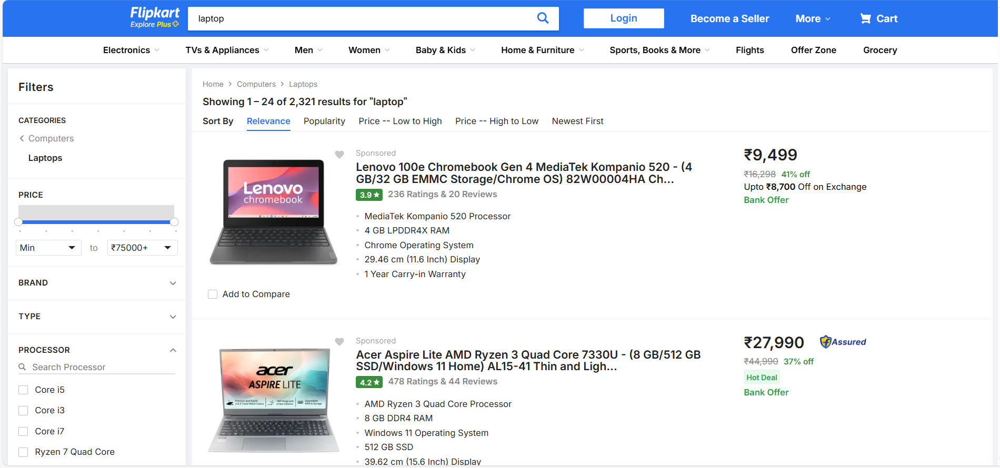
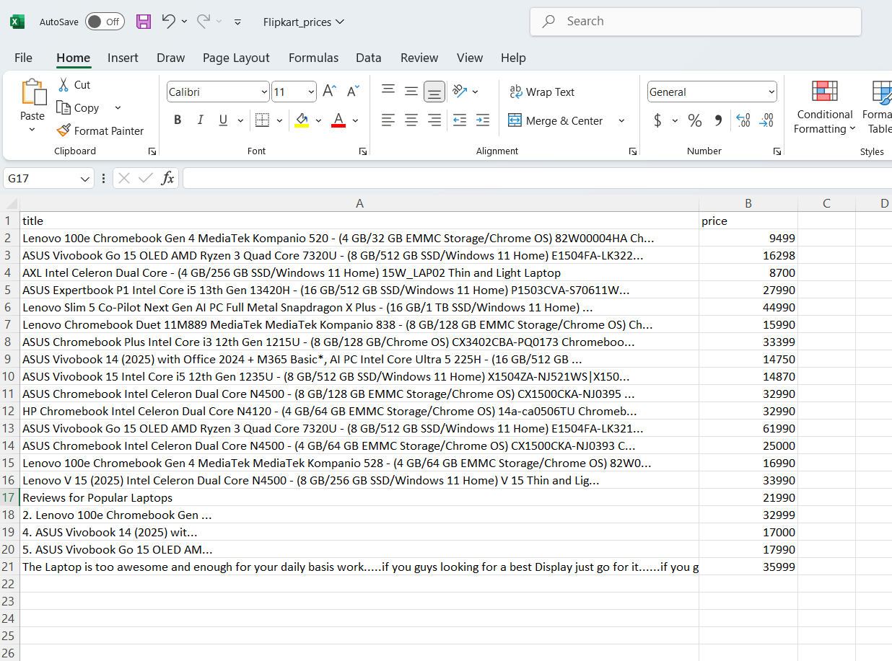

# 🛍️ Flipkart Price Scraper with Playwright (Async Python)

This project scrapes laptop product titles and prices from [Flipkart](https://www.flipkart.com) using Playwright and exports them to a clean CSV file.

> GitHub Repo: [shuhaibvvm/flipkart-price-scraper](https://github.com/shuhaibvvm/flipkart-price-scraper)

---

## 📷 Screenshots

### 🔍 Website Page Being Scraped


### 📊 Output Data Preview


---

## 🔧 Features

- ⚡ Async scraping using Playwright
- 🎯 XPath selectors for product targeting
- 🧹 Cleans prices and removes noise
- 📤 Exports to `Flipkart_prices.csv`
- 🧱 Built for easy customization and extension

---

## 🚀 Getting Started

### 1. Clone the repository
```bash
git clone https://github.com/shuhaibvvm/flipkart-price-scraper.git
cd flipkart-price-scraper
